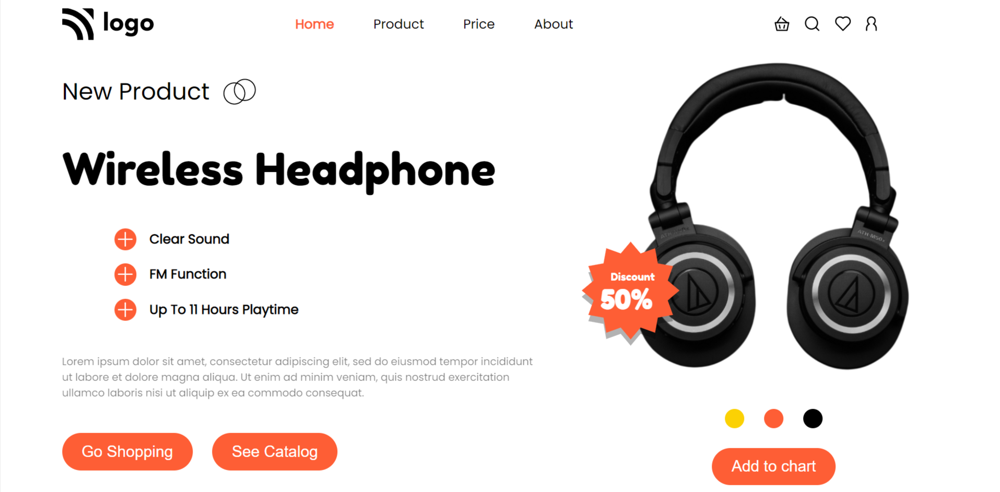

# Project_07 - HTML  and CSS 

---

## Project 07 [Live Link](https://project-07-themohitgupta.netlify.app)

---
## What I learned from this Project?

- Learned to use **css position**.
- Learned about **layout** and **flexbox**.
- Learned about use of **icons** and **buttons**.

---

### This Project took me around **6 hours** to complete.

---

---
